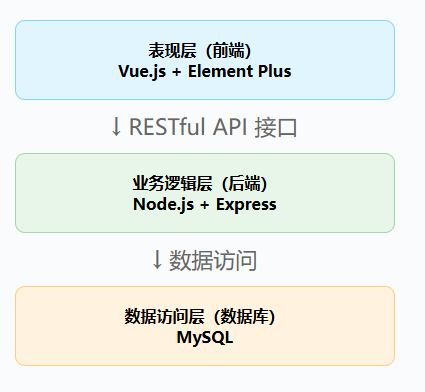
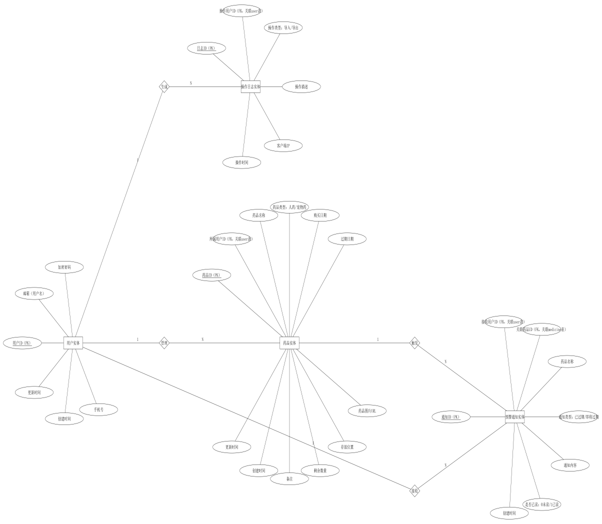
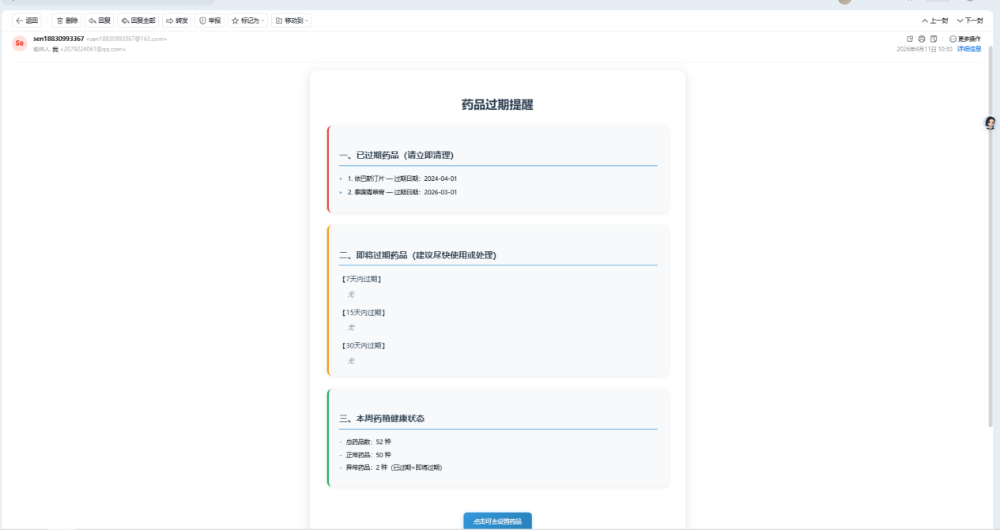
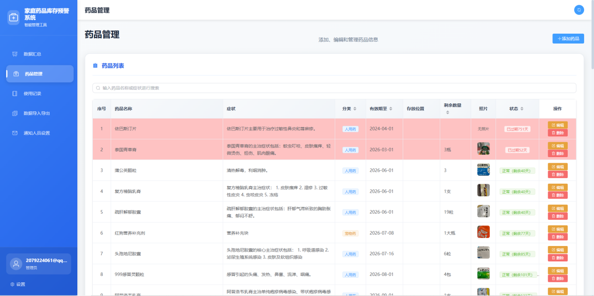
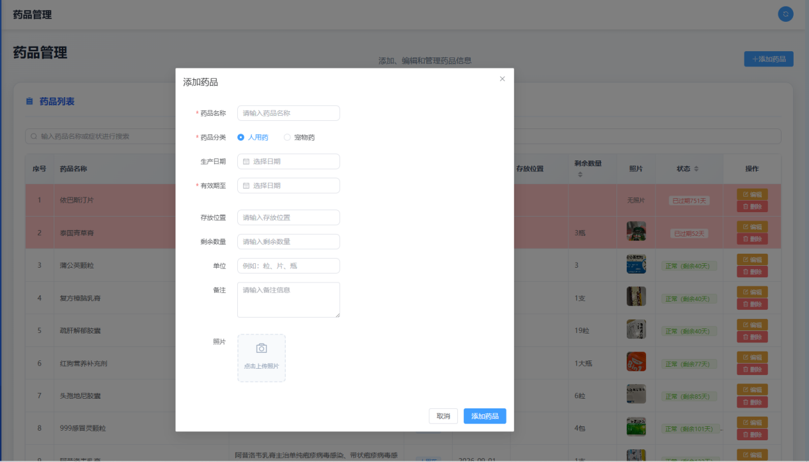
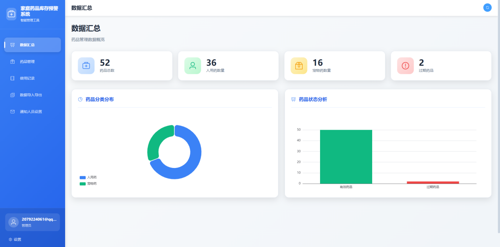

# 药品库存预警系统


一个功能完善的家庭药品库存管理系统，提供药品信息管理、过期预警、用药记录等功能。

## 📋 目录

- [项目简介](#项目简介)
- [功能特性](#功能特性)
- [技术栈](#技术栈)
- [项目结构](#项目结构)
- [快速开始](#快速开始)
  - [环境准备](#环境准备)
  - [后端配置与启动](#后端配置与启动)
  - [前端配置与启动](#前端配置与启动)
- [配置说明](#配置说明)
  - [后端环境变量](#后端环境变量)
  - [前端环境变量](#前端环境变量)
- [数据库设置](#数据库设置)
- [部署指南](#部署指南)
- [许可证](#许可证)

## 项目简介

本项目是一个家庭药品库存预警系统，帮助用户管理家庭药品，及时发现即将过期或已过期的药品，避免药品浪费和安全隐患。

## 🖼️ 界面预览

### 系统架构


### 数据库设计


### 登录页面


### 仪表板


### 药品管理


### 添加药品


### 药品详情


## 功能特性

### 用户功能
- 用户注册与登录
- 账号安全（登录失败锁定）
- 个人信息管理

### 药品管理
- 药品信息的增删改查
- 药品照片上传
- 药品导入/导出（Excel）
- 药品库存管理
- 药品存放位置记录

### 预警功能
- 药品过期自动检查
- 即将过期药品提醒
- 过期药品通知
- 通知中心（已读/未读）

### 其他功能
- 用药记录管理
- 联系人管理
- 操作日志
- 数据可视化（仪表板）

## 技术栈

### 后端
- **框架**: Express.js
- **数据库**: MySQL
- **ORM**: mysql2
- **认证**: JSON Web Token (JWT)
- **文件上传**: Multer
- **定时任务**: node-schedule
- **邮件服务**: Nodemailer

### 前端
- **构建工具**: Vite
- **框架**: Vue 3
- **UI 组件库**: Element Plus
- **状态管理**: Pinia
- **路由**: Vue Router
- **HTTP 请求**: Axios
- **图表**: ECharts
- **Excel 处理**: xlsx

## 项目结构

```
.
├── medicine-node/          # 后端项目目录
│   ├── config/             # 配置文件
│   ├── controllers/        # 控制器
│   ├── models/             # 数据模型
│   ├── routes/             # 路由
│   ├── utils/              # 工具函数
│   ├── .env.example        # 环境变量示例
│   ├── app.js              # 入口文件
│   └── db.sql              # 数据库初始化脚本
├── medicine-web/           # 前端项目目录
│   ├── src/
│   │   ├── api/            # API 接口
│   │   ├── components/     # 公共组件
│   │   ├── config/         # 配置文件
│   │   ├── router/         # 路由
│   │   ├── stores/         # 状态管理
│   │   ├── styles/         # 样式
│   │   └── views/          # 页面
│   ├── .env.development.example
│   └── .env.production.example
└── README.md               # 项目说明文档
```

## 快速开始

### 环境准备

确保你的开发环境中已经安装了以下软件：

- **Node.js** (>= 16.x)
- **MySQL** (>= 8.0)
- **Git**

### 后端配置与启动

1. 进入后端目录：

   ```bash
   cd medicine-node
   ```

2. 安装依赖：

   ```bash
   npm install
   ```

3. 配置环境变量：

   复制 `.env.example` 文件为 `.env`，并根据你的环境修改配置：

   ```bash
   cp .env.example .env
   ```

   编辑 `.env` 文件，填入你的数据库和其他配置信息：

   ```env
   # 数据库配置
   DB_HOST=localhost
   DB_PORT=3306
   DB_USER=root
   DB_PASSWORD=your_password_here
   DB_DATABASE=medicine_management
   
   # JWT 密钥（请修改为安全的密钥）
   JWT_SECRET=your_jwt_secret_key_here
   ```

4. 初始化数据库：

   在 MySQL 中创建数据库并执行初始化脚本：

   ```bash
   mysql -u root -p
   ```

   在 MySQL 命令行中执行：

   ```sql
   source d:/y/medicine-node/db.sql;
   ```

5. 启动后端服务：

   ```bash
   npm run dev
   ```

   后端服务将启动在 `http://localhost:3000`

### 前端配置与启动

1. 打开新的终端，进入前端目录：

   ```bash
   cd medicine-web
   ```

2. 安装依赖：

   ```bash
   npm install
   ```

3. 配置环境变量（可选，已配置默认值）：

   如需修改，复制 `.env.development.example` 为 `.env.development`：

   ```bash
   cp .env.development.example .env.development
   ```

4. 启动前端开发服务器：

   ```bash
   npm run dev
   ```

   前端将启动在 `http://localhost:5173`（默认端口）

## 配置说明

### 后端环境变量

在 `medicine-node/.env` 文件中配置：

| 变量名 | 说明 | 必填 | 默认值 |
|--------|------|------|--------|
| DB_HOST | 数据库主机地址 | 否 | localhost |
| DB_PORT | 数据库端口 | 否 | 3306 |
| DB_USER | 数据库用户名 | 否 | root |
| DB_PASSWORD | 数据库密码 | 是 | - |
| DB_DATABASE | 数据库名称 | 否 | medicine_management |
| JWT_SECRET | JWT 签名密钥 | 是 | - |
| EMAIL_HOST | SMTP 服务器地址（可选） | 否 | - |
| EMAIL_PORT | SMTP 端口（可选） | 否 | 587 |
| EMAIL_USER | 邮箱账号（可选） | 否 | - |
| EMAIL_PASS | 邮箱密码（可选） | 否 | - |

### 前端环境变量

在 `medicine-web/.env.development` 或 `.env.production` 中配置：

| 变量名 | 说明 | 必填 | 默认值 |
|--------|------|------|--------|
| VITE_API_BASE_URL | 后端 API 地址 | 否 | http://localhost:3000 |

## 数据库设置

1. 确保 MySQL 服务正在运行
2. 创建数据库（如使用 db.sql 脚本会自动创建）
3. 执行 `medicine-node/db.sql` 脚本初始化表结构
4. 确认数据库连接配置正确

## 部署指南

### 后端部署

1. 在服务器上安装 Node.js 和 MySQL
2. 上传代码到服务器
3. 安装依赖：`npm install`
4. 配置生产环境变量
5. 启动服务：`npm start`

推荐使用 PM2 进行进程管理：

```bash
npm install -g pm2
pm2 start app.js --name medicine-backend
```

### 前端部署

1. 构建生产版本：

   ```bash
   npm run build
   ```

2. 将 `dist` 目录的内容部署到 Nginx、Apache 或其他静态文件服务器

## 许可证

本项目采用 ISC 许可证 - 详见 LICENSE 文件

---

**注意**: 请务必在生产环境中修改默认的 JWT_SECRET 和数据库密码！
